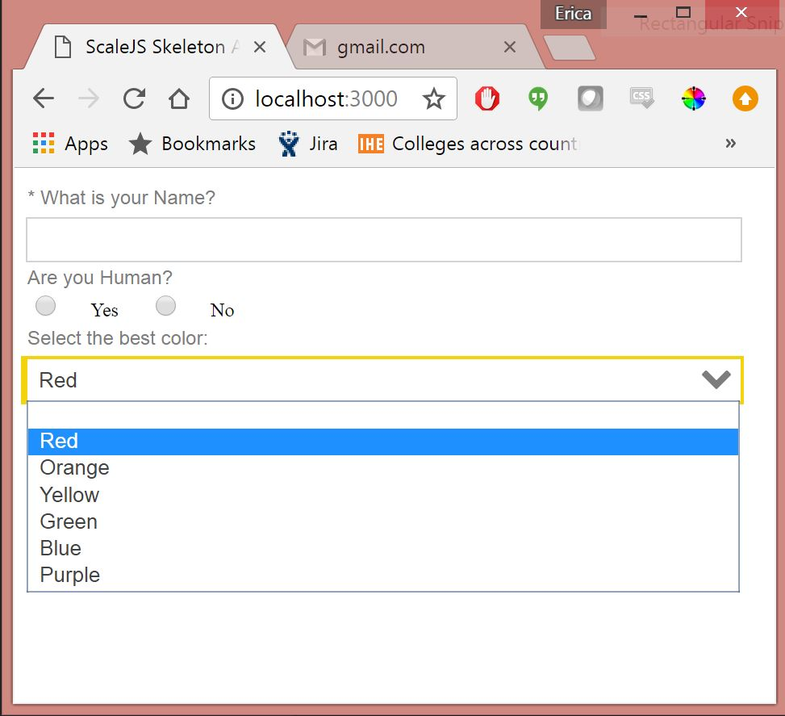
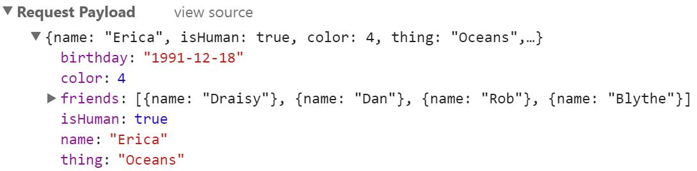

# How to build a Form with Scalejs and PJSON

Building a form with Scalejs and PJSON is simple once you know how it's done. 
Read this tutorial to learn how to do it.

You should already have an application with a Scalejs/PJSON setup.
In this tutorial I will be starting from [scalejs seed](https://github.com/EikosPartners/scalejs-app) application which is a very basic setup for Scalejs. 
You can also clone the results from this tutorial from the `form-example` branch.

## Tutorial Steps
1. Get Common
2. Add an Adapter
3. Add an Input
4. Add another Input
5. Add a Validation
6. Add a Rendered Expression
7. Add a Select that gets values from JSON
8. Add a Select that gets from a Store
9. Add a Select that filters values from Store
10. Add a List
11. Post your Form Data
12. Retrieve your Form Data

## 1. Get Common

If you do not already have common, you must have it in order to use the form elements.

`npm install --save scalejs.metadatafactory-common`

This will give you access to all of the [common](https://github.com/EikosPartners/scalejs.metadataFactory-common)
modules.
You can import the modules in the same location where others are imported.
In our sample app, that location is the `modules.js` file.

The seed application in this tutorial is already importing common in order to use the template module.

## 2. Add an Adapter

The [adapter](https://eikospartners.github.io/scalejs.metadataFactory-common/doc/module-adapter.html)
module allows for tracking of the other components which will be necessary to gather the data for a POST and use expressions.

First ensure the Adapter is being imported into your application

```JavaScript
import 'scalejs.metadatafactory-common/dist/adapter/adapterModule';
```

Now in your JSON file you will add the adapter:

```JSON
{
    "type": "adapter",
    "children": [
        
    ]
}
```

## 3. Add an Input

The [input](https://eikospartners.github.io/scalejs.metadataFactory-common/doc/module-input.html)
component is used to gather user data input. It supports plenty of functionality, as any input functionality (large and small)
will be baked into the options of an inputViewModel.

We will start off with a very simple input. Again, ensure the Input is being imported into your application.

```JavaScript
import 'scalejs.metadatafactory-common/dist/input/inputModule';
```

In addition to this, our input module relies on an autocomplete package that is currently not configured correctly. 
As a work around to this, we must add the following to your *webpack.config* `resolve.alias` fields.

```JavaScript
'jquery-ui/autocomplete':  path.join(__dirname, 'node_modules/jquery-ui/ui/widgets/autocomplete.js')`
```

Because we made changes to webpack.config you need to restart npm for the changes to take effect.

Add the following input JSON as a child of the adapter

```JSON
{
    "type": "adapter",
    "children": [
        {            
            "id": "name",
            "type": "input",
            "inputType": "text",
            "label": "What is your Name?"
        }
    ]
}
```

Refresh your application to see the new input.


## 4. Add another Input

A form rarely has just one question so let's add another field.
This time we will use the datepicker type.

```JSON
{
    "type": "adapter",
    "children": [
        {            
            "id": "name",
            "type": "input",
            "inputType": "text",
            "label": "What is your Name?"
        },
        {            
            "id": "birthday",
            "type": "input",
            "inputType": "datepicker",
            "label": "What is your Birthday?"
        }
    ]
}
```

Now you will see two inputs on the page. One of them is of type datepicker.


## 5. Add a Validation

Forms are great but one thing we need is to be able to add validations.
For most of your validation needs, you can use one of the ones specified in [Knockout-Validation](https://github.com/Knockout-Contrib/Knockout-Validation).

In addition to this, we also have expression validations which utilize the context of the PJSON form
to allow you to write conditional validations against other values which are already in the form.

```JSON
{
    "type": "adapter",
    "children": [
        {            
            "id": "name",
            "type": "input",
            "inputType": "text",
            "label": "What is your Name?",
            "options": {
                "validations": {
                    "required": true
                }
            }
        },
        {            
            "id": "birthday",
            "type": "input",
            "inputType": "datepicker",
            "label": "What is your Birthday?"
        }
    ]
}
```


## 6. Add Rendered Expression

All PJSON Components have the capability to use rendered expressions.
A rendered expression is an expression (again, based on context) which
will determine whether or not the component will be rendered.

Once an input is not rendered, it also will not be available within the data
context, so if you still need adapter tracking, you'll need to set `trackIfHidden` to true.

For these changes I'll add an additional input that will determine whether or not we need
to gather the user's birthday.

```JSON
{
    "type": "adapter",
    "children": [
        {            
            "id": "name",
            "type": "input",
            "inputType": "text",
            "label": "What is your Name?",
            "options": {
                "validations": {
                    "required": true
                }
            }
        },
        {            
            "id": "isHuman",
            "type": "input",
            "inputType": "radio",
            "label": "Are you Human?"
        },
        {            
            "id": "birthday",
            "rendered": "isHuman",
            "type": "input",
            "inputType": "datepicker",
            "label": "What is your Birthday?"
        }
    ]
}
```

First the user must specify if they are indeed a human.


If so, they have a birthday so only then do we ask for it.


What happened here is that we added a radio input which defaults to Yes/No and underlying values of true/false. 

This is also the first time we have used the ids I have been adding with each input.
Every input with an **id** is tracked by the parent adapter. In order to leverage the values
from other inputs, you use the id. 

For the rendered expression for our birthday input,
we are using `isHuman`, which evaluated to the value of the **isHuman** input. Which is true/false or empty.
The expression will only evaluate to **true** if the user selects yes which will control the rendering of the birthday input.

Though `isHuman` may be a very simple expression, there are plenty of other 
ways one can write and leverage expressions. For instance, another way this could have been written is `isHuman === true`.


## 7. Add a Select that gets from JSON

Now that we have added a few inputs we might want to start doing something
more complex, such as getting values for a select from a reference data endpoint.

To make it easy let's just start off by adding a select that will get from a local data source (i.e. from PJSON).

```JSON
{
    "type": "adapter",
    "children": [
        {            
            "id": "name",
            "type": "input",
            "inputType": "text",
            "label": "What is your Name?",
            "options": {
                "validations": {
                    "required": true
                }
            }
        },
        {            
            "id": "isHuman",
            "type": "input",
            "inputType": "radio",
            "label": "Are you Human?"
        },
        {            
            "id": "birthday",
            "rendered": "isHuman",
            "type": "input",
            "inputType": "datepicker",
            "label": "What is your Birthday?"
        },
        {            
            "id": "color",
            "type": "input",
            "inputType": "select",
            "label": "Select the best color:",
            "options": {
                "values": [
                    "Red",
                    "Orange",
                    "Yellow",
                    "Green",
                    "Blue",
                    "Purple"
                ]
            }
        }
    ]
}
```

That was almost too easy. Better yet if these values were coming from a server
so that we could change the options the user can select from without modifying our UI assets.

## 8. Add a Select that gets from a Store

In step 7 we added a select that simply gets its options from the JSON.
Now we will add an extra step to get these values from a REST call.

In order to do this, I will add a simple endpoint to our mock backend to retrieve the values:

```JavaScript
/* GET Colors */
app.get('/colors', (req, res, next) => {
    res.send({
        data: [
            {
                value: 0,
                text: 'Red'
            },
            {
                value: 1,
                text: 'Orange'
            },
            {
                value: 2,
                text: 'Yellow'
            },
            {
                value: 3,
                text: 'Green'
            },
            {
                value: 4,
                text: 'Blue'
            },
            {
                value: 5,
                text: 'Purple'
            }
        ]
    })
});
```

After a server restart and I have verified this data is coming in as desired, now I will add a store to our PJSON
and hook the Select source into this.

A `store` is a PJSON Data Component that takes in a dataSourceEndpoint object and populates a key 
within the `scalejs.noticeboard` under a specified `storeKey`.

The first step when using a new component is to ensure it is being imported with your other modules:

```JavaScript
import 'scalejs.metadatafactory-common/dist/store/storeModule';
```

Underneath the hood, the `store` relies on an `action`, more specifically, an `ajax` action to perform its data-service call.

To that end, we need two more imports to satisfy the prerequisites we need to use store:

```JavaScript
import 'scalejs.metadatafactory-common/dist/action/actionModule';
import 'scalejs.metadatafactory-common/dist/action/actions/ajax';
```

Now that we have imported store, action, and an ajax action, and also assuming your PJSON/Scalejs Setup has a proper dataservice (such as the one included in the tutorial seed),
we can use this JSON to populate our select:

```JSON
{
    "type": "adapter",
    "children": [
        {
            "type": "store",
            "keyMap": {
                "resultsKey": "data"
            },
            "storeKey": "colorsSource",
            "dataSourceEndpoint": {
                "target": {
                    "uri": "colors"
                }
            }
        },
        {            
            "id": "name",
            "type": "input",
            "inputType": "text",
            "label": "What is your Name?",
            "options": {
                "validations": {
                    "required": true
                }
            }
        },
        {            
            "id": "isHuman",
            "type": "input",
            "inputType": "radio",
            "label": "Are you Human?"
        },
        {            
            "id": "birthday",
            "rendered": "isHuman",
            "type": "input",
            "inputType": "datepicker",
            "label": "What is your Birthday?"
        },
        {            
            "id": "color",
            "type": "input",
            "inputType": "select",
            "label": "Select the best color:",
            "options": {
                "values": {
                    "fromArray": "store.colorsSource",
                    "textKey": "text",
                    "valueKey": "value"
                }
            }
        }
    ]
}
```

We have added the `store` to the top of the `adapter`'s children 
and also modified the `values` option in the select from the previous step.



One neat thing about this approach to populating dropdowns is how the `fromArray` field works.
The `fromArray` field expects an *expression* to be passed to it. By default, all components have access to 
the **store** object in their expressions. In this case we are using a *memberExpression* to get the
`colorsSource` from the `store`. 

This unexpected usecase for our expression parsing engine allows even greater manipulation of select sources
straight from JSON.

## 9. Add a Select that filters values from Store

So far everything we have done has been rather straight forward. 
But sometimes a form requires a little extra functionality.
In this new use case we want to leverage the expression parsing capabilities 
of a select dropdown's `fromArray` field and get a chance to use lodash in our expressions.

In order to do this we will filter a second select based upon what was selected in the first one.
Add a new REST endpoint for this new data source (requires server restart):

```JavaScript
/* GET Things */
app.get('/things', (req, res, next) => {
    res.send({
        data: [
            {
                color: 0,
                text: 'Apples'
            },
            {
                color: 0,
                text: 'Fire Trucks'
            },
            {
                color: 1,
                text: 'Oranges'
            },
            {
                color: 4,
                text: 'Sky'
            },
            {
                color: 4,
                text: 'Oceans'
            },
            {
                color: 4,
                text: 'BlueBerry'
            }
        ]
    })
});
```

When the user selects "blue" they will only be able to select things which are blue.

Now we will make this JSON, adding another `store` and another `select`.

```JSON
{
    "type": "adapter",
    "children": [
        {
            "type": "store",
            "keyMap": {
                "resultsKey": "data"
            },
            "storeKey": "colorsSource",
            "dataSourceEndpoint": {
                "target": {
                    "uri": "colors"
                }
            }
        },
        {
            "type": "store",
            "keyMap": {
                "resultsKey": "data"
            },
            "storeKey": "thingsSource",
            "dataSourceEndpoint": {
                "target": {
                    "uri": "things"
                }
            }
        },
        {            
            "id": "name",
            "type": "input",
            "inputType": "text",
            "label": "What is your Name?",
            "options": {
                "validations": {
                    "required": true
                }
            }
        },
        {            
            "id": "isHuman",
            "type": "input",
            "inputType": "radio",
            "label": "Are you Human?"
        },
        {            
            "id": "birthday",
            "rendered": "isHuman",
            "type": "input",
            "inputType": "datepicker",
            "label": "What is your Birthday?"
        },
        {            
            "id": "color",
            "type": "input",
            "inputType": "select",
            "label": "Select the best color:",
            "options": {
                "values": {
                    "fromArray": "store.colorsSource",
                    "textKey": "text",
                    "valueKey": "value"
                }
            }
        },
        {            
            "id": "thing",
            "type": "input",
            "inputType": "select",
            "label": "Select a thing of that color:",
            "options": {
                "values": {
                    "fromArray": "_.filter(store.thingsSource, ['color', color])",
                    "textKey": "text",
                    "valueKey": "text"
                }
            }
        }
    ]
}
```

This actually does work, once we have selected "blue" we can see the options for the second dropdown are filtered.


To understand further what is going on here, let's deconstruct the expression:

`_.filter(store.thingsSource, ['color', color])`

[_.filter](https://lodash.com/docs/4.17.2#filter) is being passed 2 arguments,
`store.thingsSource`  and an array which tells lodash which property to filter on.
In this case, by passing `['color', color]`, it will check each object in the source array's `color` field
and make sure it matches the result of the user-input into the `color` select inputbox. 
(color is the **id** of the color selection field)


As you can see, having the ability to use lodash in our expressions allows us to use advanced functionality without having to create custom code.

## 10. Add a List

Now that we have covered basic inputs and more, one more form feature we would like to show before we move into Persisting our form data is to have a list entry.
That means you want to gather multiple answers from the user that they enter in a list format.
You have two options for list entry, `list` and `listAdvanced`. We will cover these more indepth in our APIs and other docs, with the main difference being that 
`listAdvanced` gives you a tabular view of your list as well as the ability to populate additional headers and footers.

For our simple tutorial we will only use a `list`. A List takes in an array of `items` which are other PJSON components, namely, inputs.

Again we will start off by importing the module we desire:

```JavaScript
import 'scalejs.metadatafactory-common/dist/list/listModule';
```

In our JSON we will add 2 components - a `textLabel` component to have a label without the input,
and a `list` component. Within the List's `items` array, we will specify an `input` and for aesthetic purposes we will hide the label.

```JSON
{
    "type": "adapter",
    "children": [
        {
            "type": "store",
            "keyMap": {
                "resultsKey": "data"
            },
            "storeKey": "colorsSource",
            "dataSourceEndpoint": {
                "target": {
                    "uri": "colors"
                }
            }
        },
        {
            "type": "store",
            "keyMap": {
                "resultsKey": "data"
            },
            "storeKey": "thingsSource",
            "dataSourceEndpoint": {
                "target": {
                    "uri": "things"
                }
            }
        },
        {            
            "id": "name",
            "type": "input",
            "inputType": "text",
            "label": "What is your Name?",
            "options": {
                "validations": {
                    "required": true
                }
            }
        },
        {            
            "id": "isHuman",
            "type": "input",
            "inputType": "radio",
            "label": "Are you Human?"
        },
        {            
            "id": "birthday",
            "rendered": "isHuman",
            "type": "input",
            "inputType": "datepicker",
            "label": "What is your Birthday?"
        },
        {            
            "id": "color",
            "type": "input",
            "inputType": "select",
            "label": "Select the best color:",
            "options": {
                "values": {
                    "fromArray": "store.colorsSource",
                    "textKey": "text",
                    "valueKey": "value"
                }
            }
        },
        {            
            "id": "thing",
            "type": "input",
            "inputType": "select",
            "label": "Select a thing of that color:",
            "options": {
                "values": {
                    "fromArray": "_.filter(store.thingsSource, ['color', color])",
                    "textKey": "text",
                    "valueKey": "text"
                }
            }
        },
        {
            "type": "input",
            "inputType": "textLabel",
            "label": "Please list your friends:"
        },
        {
            "id": "friends",
            "type": "list",
            "items": [
                {
                    "id": "name",
                    "type": "input",
                    "inputType": "text",
                    "options": {
                        "showLabel": false
                    }
                }
            ]
        }
    ]
}
```

After refreshing you will see an "Add" button appear which allows you to add items to the list.


## 11. POST your form data

Now that we have created a beautiful(ly functional) form, we will want to try to POST the data and persist it on our backend.

For this we will want to add two things: an ajax save `action` and a `validations` component, so that we cannot save until our form is valid.

We already imported the `action` and the `ajax` action when we used a `store`,
so we only need to import the validations component:

```JavaScript
import 'scalejs.metadatafactory-common/dist/validations/validationsModule';
```

Once imported you can add the validations component as a child to the adapter.
Also, we will want to add an `id` to the adapter so that we can leverage the validations component,
which relies upon the `id` of the adapter.


```JSON
{
    "type": "adapter",
    "id": "basicForm",
    "children": [
        {
            "type": "validations"
        },
```

At the end of our form we will add an `action` with an `actionType` of ajax and
tell it to POST to a REST service (which will be implemented in the next step).

```JSON
        {
            "type": "action",
            "actionType": "ajax",
            "text": "Save",
            "validate": "basicForm.validate",
            "options": {
                "target": {
                    "uri": "form",
                    "options": {
                        "type": "POST"
                    }
                }
            }
        }
```

Our full JSON now looks like this:

```JSON
{
    "type": "adapter",
    "id": "basicForm",
    "children": [
        {
            "type": "validations"
        },
        {
            "type": "store",
            "keyMap": {
                "resultsKey": "data"
            },
            "storeKey": "colorsSource",
            "dataSourceEndpoint": {
                "target": {
                    "uri": "colors"
                }
            }
        },
        {
            "type": "store",
            "keyMap": {
                "resultsKey": "data"
            },
            "storeKey": "thingsSource",
            "dataSourceEndpoint": {
                "target": {
                    "uri": "things"
                }
            }
        },
        {            
            "id": "name",
            "type": "input",
            "inputType": "text",
            "label": "What is your Name?",
            "options": {
                "validations": {
                    "required": true
                }
            }
        },
        {            
            "id": "isHuman",
            "type": "input",
            "inputType": "radio",
            "label": "Are you Human?"
        },
        {            
            "id": "birthday",
            "rendered": "isHuman",
            "type": "input",
            "inputType": "datepicker",
            "label": "What is your Birthday?"
        },
        {            
            "id": "color",
            "type": "input",
            "inputType": "select",
            "label": "Select the best color:",
            "options": {
                "values": {
                    "fromArray": "store.colorsSource",
                    "textKey": "text",
                    "valueKey": "value"
                }
            }
        },
        {            
            "id": "thing",
            "type": "input",
            "inputType": "select",
            "label": "Select a thing of that color:",
            "options": {
                "values": {
                    "fromArray": "_.filter(store.thingsSource, ['color', color])",
                    "textKey": "text",
                    "valueKey": "text"
                }
            }
        },
        {
            "type": "input",
            "inputType": "textLabel",
            "label": "Please list your friends:"
        },
        {
            "id": "friends",
            "type": "list",
            "items": [
                {
                    "id": "name",
                    "type": "input",
                    "inputType": "text",
                    "options": {
                        "showLabel": false
                    }
                }
            ]
        },
        {
            "type": "action",
            "actionType": "ajax",
            "text": "Save",
            "validate": "basicForm.validate",
            "options": {
                "target": {
                    "uri": "form",
                    "options": {
                        "type": "POST"
                    }
                }
            }
        }
    ]
}
```

Now we can fill out our form and press the save button:


And we are able to verify the data is being sent with the network tab:



As for the validations, if you were to try to save without having filled 
out the required field, you will see the validations component in the UI:


This is caused by the connection between the `validate` option in the action,
which notifies the `validations` component that it needs to check if the form is valid
before the action can be performed. In this case, since the form is invalid,
the AJAX call does not get sent.


## 12. Retrieve your Form Data

To retrieve the form data, first let us add some endpoints to our backend to support persisting the data.
Since we are not overly fancy here there is just a single endpoint to take the data and store it in a variable,
and another endpoint to retrieve it.

```JavaScript
/* GET/POST form data */

let formData = null;

app.get('/form', (req, res, next) => {
    res.send(formData);
});

app.post('/form', (req, res, next) => {
    formData = req.body;
    res.send({
        success: true
    })
});

```

After a server restart, the POST call from before should persist the data, 
which you can double-check by hitting the form GET endpoint.

Now we just need to make sure the Form is populated with this data by specifying the
GET request for the form within the adapter.

Although this populates the adapter's context with the data from the GET
request, in order for the inputs within the form to have their values set we need to
import and include another component, the `setValue` component.

The reason we created a seperate `setValue` component is to keep the setting of
the data seperate from the tracking and population of adapter context. 

Like other modules you need to import it:

```JavaScript
import 'scalejs.metadatafactory-common/dist/setValue/setValueModule';
```

And also add it to your adapter's children, as well as a dataSourceEndpoint to 
tell our adapter where to GET the data from.

```JSON
{
    "type": "adapter",
    "id": "basicForm",
    "dataSourceEndpoint": {
        "target": {
            "uri": "form"
        }
    },
    "children": [
        {
            "type": "validations"
        },
        {
            "type": "setValue"
        },
        {
            "type": "store",
            "keyMap": {
                "resultsKey": "data"
            },
            "storeKey": "colorsSource",
            "dataSourceEndpoint": {
                "target": {
                    "uri": "colors"
                }
            }
        },
        {
            "type": "store",
            "keyMap": {
                "resultsKey": "data"
            },
            "storeKey": "thingsSource",
            "dataSourceEndpoint": {
                "target": {
                    "uri": "things"
                }
            }
        },
        {            
            "id": "name",
            "type": "input",
            "inputType": "text",
            "label": "What is your Name?",
            "options": {
                "validations": {
                    "required": true
                }
            }
        },
        {            
            "id": "isHuman",
            "type": "input",
            "inputType": "radio",
            "label": "Are you Human?"
        },
        {            
            "id": "birthday",
            "rendered": "isHuman",
            "type": "input",
            "inputType": "datepicker",
            "label": "What is your Birthday?"
        },
        {            
            "id": "color",
            "type": "input",
            "inputType": "select",
            "label": "Select the best color:",
            "options": {
                "values": {
                    "fromArray": "store.colorsSource",
                    "textKey": "text",
                    "valueKey": "value"
                }
            }
        },
        {            
            "id": "thing",
            "type": "input",
            "inputType": "select",
            "label": "Select a thing of that color:",
            "options": {
                "values": {
                    "fromArray": "_.filter(store.thingsSource, ['color', color])",
                    "textKey": "text",
                    "valueKey": "text"
                }
            }
        },
        {
            "type": "input",
            "inputType": "textLabel",
            "label": "Please list your friends:"
        },
        {
            "id": "friends",
            "type": "list",
            "items": [
                {
                    "id": "name",
                    "type": "input",
                    "inputType": "text",
                    "options": {
                        "showLabel": false
                    }
                }
            ]
        },
        {
            "type": "action",
            "actionType": "ajax",
            "text": "Save",
            "validate": "basicForm.validate",
            "options": {
                "target": {
                    "uri": "form",
                    "options": {
                        "type": "POST"
                    }
                }
            }
        }
    ]
}
```

<!--```JSON

```-->